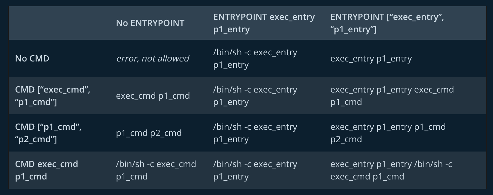

## Docker hub repo:
- [moreqpi](https://hub.docker.com/r/moreqpi)

---

### Docker info

- [ENTRYPOINT and CMD understanding](https://docs.docker.com/engine/reference/builder/#understand-how-cmd-and-entrypoint-interact)

